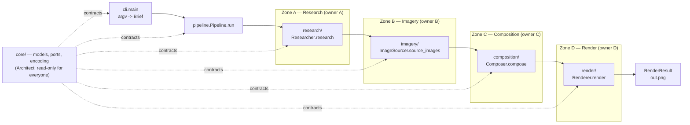

# Infographic Generator — Architecture & Build Plan

Prompt in, PNG out. Four stages behind four `typing.Protocol` seams so three teams can build in
parallel and swap stubs for real AI agents without touching each other's code.

## Pipeline



Data flow, concretely:

1. `Brief(prompt, options)` — the user's text plus width/height/theme/scale. Note `RenderOptions`
   is read by the **composer**, not the renderer: the renderer never sees a `Brief`, so the composer
   copies `height_px` and `device_scale_factor` into the `Composition`.
2. `Researcher.research(brief) -> ResearchContent` — title, subtitle, summary, `Fact`s, narrative
   `NarrativeSection`s, `keywords`, and `Source` provenance on anything attributable.
3. `ImageSourcer.source_images(brief, content) -> Sequence[ImageAsset]` — images already downloaded
   (`content: bytes | Path`), each carrying `ImageCredit` (license is mandatory) and `alt_text`.
   Ordered by significance; the first `HERO` asset is the lead image.
4. `Composer.compose(brief, content, images) -> Composition` — one **self-contained** HTML string.
5. `Renderer.render(composition, output_path) -> RenderResult` — Playwright screenshots it to PNG.

## Module layout & ownership

| Path | Owner | Contents |
|---|---|---|
| `pyproject.toml` | Architect | deps, hatchling src-layout, console script, pytest config |
| `src/infographic_generator/core/` | Architect | `models.py`, `ports.py`, `encoding.py` — frozen dataclasses, Protocols, data-URI helper |
| `src/infographic_generator/research/` | Owner A | `Researcher` implementations (stub now, AI agent later) |
| `src/infographic_generator/imagery/` | Owner B | `ImageSourcer` implementations |
| `src/infographic_generator/composition/` | Owner C | `Composer` + Jinja2 templates |
| `src/infographic_generator/render/` | shared | Playwright `Renderer` |
| `pipeline.py`, `cli.py` | shared | wiring + argparse — no single owner, coordinate before changing |
| `tests/` | everyone | one test module per zone; `test_contracts.py` is the Architect's |
| `assets/` | Owner B | local image fixtures for the stub |

Nobody edits `core/` or `pyproject.toml`. Need a field or a dep? Ask the Architect.

Zone D (`render/`, `pipeline.py`, `cli.py`) is the shared zone — no single owner, per `CLAUDE.md`.
All three implementers coordinate before changing it.

## Two decisions that are already made

**Everything is `async`.** All four Protocol methods are coroutines. The real implementations do
network and Playwright I/O; stubs just `return` immediately. Consistency beats a sync/async split.

**Composition output is a single self-contained HTML string.** CSS inline in a `<style>` tag,
images inlined as `data:` URIs via `core.encoding.to_data_uri(asset)`, zero external requests at
render time. Consequences:

- `Renderer` uses `page.set_content(...)` and never needs a base URL, a temp dir, or a web server.
- Renders are deterministic and offline — no flaky screenshots from a slow CDN.
- The composition owner never hand-rolls base64; call `to_data_uri`.
- The renderer aborts all browser network requests, so a composition that reaches for a CDN fails
  loudly instead of rendering blank boxes. The promise is an enforced invariant, not a convention.

Corollary the composer must not miss: everything in `ResearchContent` and `ImageCredit` is untrusted
text scraped from the web. Jinja2's default is `autoescape=False` — use `Environment(autoescape=True)`.

## Swapping a stub for a real AI agent

The seam is the Protocol, so the swap is one import and one argument in `cli.py::build_pipeline`, the
only place the concrete stages are named — nothing else moves.

1. Write the real class in your own package, e.g. `research/agent.py::LlmResearcher`, implementing
   the same `async def research(self, brief: Brief) -> ResearchContent`.
2. Fill the provenance fields the stub hard-codes: real `Source(url=..., title=..., retrieved_at=...)`
   per fact, real `ImageCredit(license=..., author=..., source=...)` per image. These fields exist
   today precisely so this step is a fill-in, not a schema change.
3. Point `cli.py::build_pipeline` at it: `Pipeline(researcher=LlmResearcher(client), ...)`. Keep the
   stub as the default for offline tests.
4. Tests written against the stub keep passing, because they assert on the types, not the panda.

Rules of thumb: no I/O in `core/`; agents own their own retries, timeouts, and API keys; failures
propagate as exceptions — the pipeline does no recovery.

Out of scope for v1: a compose -> render -> critique loop (the standard shape for a real layout
agent). Adding one later changes `Pipeline.run`, not the ports. Also unresolved: whether a composite
PNG built from CC BY-SA images inherits ShareAlike. Decide it before shipping anything publicly.

## Verification

```bash
uv sync
uv run playwright install chromium
uv run python -c "import infographic_generator.core.models"
uv run pytest
uv run infographic "the giant panda" -o out.png   # once owner D lands cli.py
```
